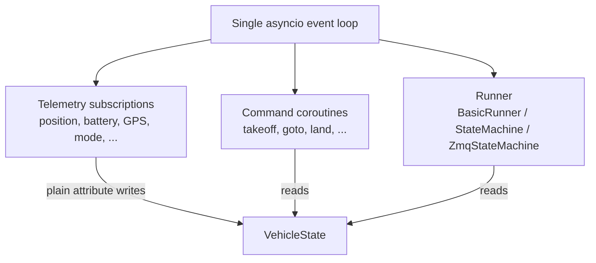

## Single event loop

v1 ran two concurrent loops: an asyncio loop for user code and a background thread for MAVSDK telemetry. Synchronising state between the two required `ThreadSafeValue` wrappers around every telemetry attribute.

v2 places everything on one asyncio event loop. MAVSDK telemetry subscriptions, command coroutines, and runner logic all run on the same loop. This eliminates lock overhead and makes error propagation straightforward — any exception surfaces naturally through `await`.



## Native async telemetry

Telemetry is populated by long-running async generator tasks started in `Vehicle._start_telemetry()`. Each subscription writes directly to a `VehicleState` object's plain attributes — no locking, no `ThreadSafeValue`.

Because all writes and reads happen on the same event loop, accessing `drone.position`, `drone.battery`, or `drone.gps` from any coroutine is safe and always returns the most recent data.

```python
# Telemetry is live: just read the property
print(drone.position)   # Coordinate updated by subscription
print(drone.battery)    # Battery updated by subscription
print(drone.heading)    # float updated by subscription
```

Subscriptions started by `connect()` include: position, attitude, velocity, GPS info, battery, flight mode, armed state, health/armable, home position, and MAVLink SYS\_STATUS.

## VehicleTask for non-blocking commands

Blocking commands (`await drone.goto_coordinates(target)`) suspend the caller until the vehicle arrives. For concurrent mission logic, pass `blocking=False` to receive a `VehicleTask`:

```python
handle = await drone.goto_coordinates(target, blocking=False)

# Do other work while the drone navigates
while not handle.is_done():
    print(f"Progress: {handle.progress:.0%}")
    await asyncio.sleep(1)

await handle.wait_done()  # raises if an error occurred
```

`VehicleTask` tracks progress (0.0–1.0), supports cancellation (`handle.cancel()` triggers RTL on drones or hold on rovers), and propagates errors through `wait_done()`.

## Descriptor-based runners and config dataclasses

Runner registration uses Python descriptors that call `__set_name__` at class definition time. This means configuration is established before any instance is created and is available as a class-level `config` attribute.

```python
class MyMission(BasicRunner):
    @entrypoint          # _EntrypointDescriptor calls __set_name__ -> BasicRunnerConfig
    async def run(self, drone: Drone):
        ...

print(MyMission.config)  # BasicRunnerConfig(entrypoint='run')
```

Alternatively, set the config dataclass explicitly (equivalent result):

```python
class MyMission(BasicRunner):
    config = BasicRunnerConfig(entrypoint="run")
    async def run(self, drone: Drone):
        ...
```

The same pattern applies to `StateMachine` (`StateMachineConfig`) and `ZmqStateMachine` (`ZmqStateMachineConfig`).

## Built-in safety and connection handling

### Command validation

Three `can_*` methods on every vehicle check preconditions before a command runs:

- `can_takeoff(altitude)` — armable flag, GPS 3D fix, minimum battery, optional `SafetyCheckerClient`
- `can_goto(target, tolerance)` — tolerance bounds, optional `SafetyCheckerClient`
- `can_land()` — optional `SafetyCheckerClient`

All return `(bool, str)` — the bool indicates success, the string describes the failure.

### SafetyCheckerClient

Passed to `connect(safety=...)`, the client forwards validation requests to an external SafetyCheckerServer over ZMQ. When no server is configured, `NoOpSafetyChecker` passes all validations and logs a warning.

### ConnectionHandler

`ConnectionHandler` monitors the vehicle heartbeat in the background. If no telemetry is received within the timeout window, it sets an `asyncio.Future` exception that races against the mission coroutine. `BasicRunner` and `StateMachine` both use `_run_with_disarm_guard` to detect unexpected disarms and raise `UnexpectedDisarmError` cleanly.

## Component map

```
aerpawlib.v2
├── Vehicle (base.py)          — connect, properties, set_armed, set_groundspeed, close
│   ├── Drone (drone.py)       — takeoff, land, goto_coordinates, set_heading,
│   │                            set_velocity, stop_velocity, return_to_launch
│   └── Rover (rover.py)       — goto_coordinates, set_velocity
├── VehicleTask (base.py)      — progress, cancel, wait_done
├── Runner (runner.py)         — base class
│   ├── BasicRunner            — @entrypoint
│   ├── StateMachine           — @state, @timed_state, @background, @at_init
│   └── ZmqStateMachine        — @expose_zmq, @expose_field_zmq,
│                                transition_runner, query_field
├── types.py                   — Coordinate, VectorNED, Battery, GPSInfo, Attitude
├── plan.py                    — read_from_plan, read_from_plan_complete
├── geofence.py                — read_geofence, inside, do_intersect
├── external.py                — ExternalProcess
├── zmqutil.py                 — run_zmq_proxy, check_zmq_proxy_reachable
├── exceptions.py              — AerpawlibError hierarchy
├── testing.py                 — MockVehicle
└── safety/
    ├── checker.py             — SafetyCheckerClient, NoOpSafetyChecker
    ├── connection.py          — ConnectionHandler
    └── validation.py         — PreflightChecks
```
